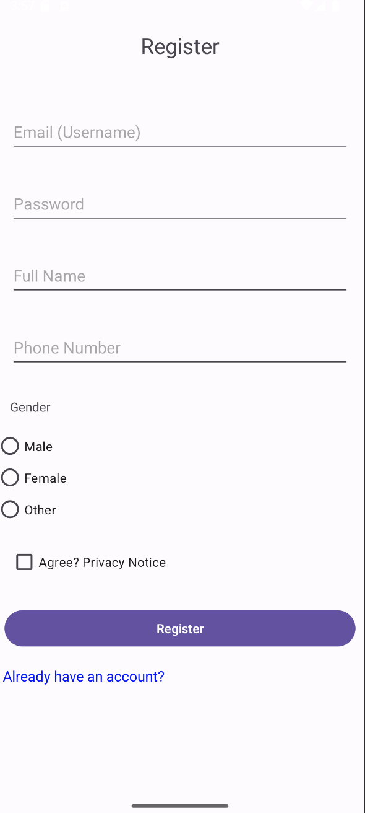

# Android Login Application

This is a simple Android login and registration application built with Java/Kotlin.  
The app allows users to create a new account and log in using a username and password.

---

## ✨ Features

- Login screen with username and password
- Registration screen with:
  - Email (Username)
  - Password
  - Full Name
  - Phone Number
  - Gender selection
  - Privacy agreement checkbox
- Navigation between login and register screens

---

## 📷 Screenshots

### Login Page


### Registration Page



---

## 🚀 How to Run

1. Clone the repository:
   ```bash
   git clone https://github.com/Mahtam94/Android_Login_Page.git
